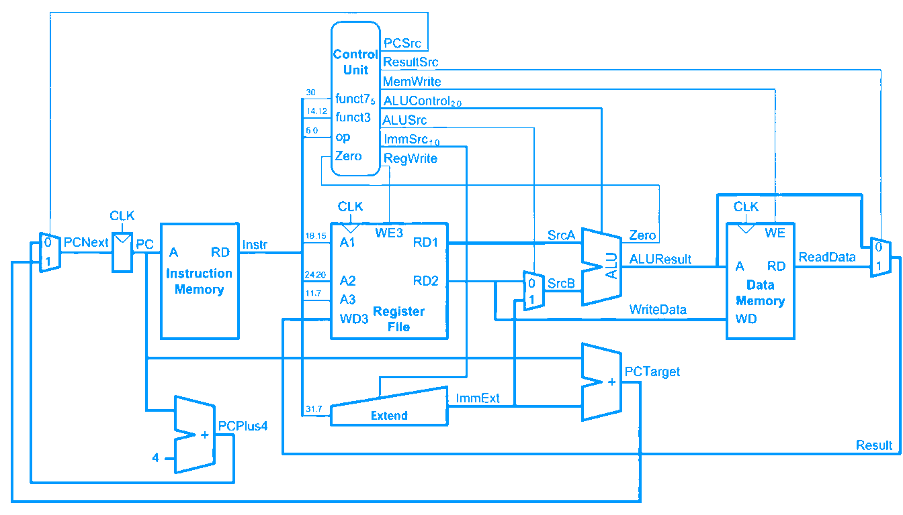

# RISC-V Single-Cycle Processor Implementation

> **Computer Architecture - University of Tehran - Department of Electrical & Computer Engineering**

  

## 📌 Overview

This repository contains the Register Transfer Level (RTL) implementation of a **Single-Cycle RISC-V Processor**. This project was developed as the *Second Assignment* for the *Computer Architecture* course at the University of Tehran.

The processor executes each instruction in one clock cycle, providing a clear and direct implementation of the RISC-V Instruction Set Architecture (ISA). It handles fundamental instruction types including R-type, I-type, Load, Store, and Branching.

## 🏗️ Architecture

The design is strictly modular, consisting of a comprehensive datapath and a central controller.

### 🗺️ DataPath Design

The datapath manages the execution flow and data processing. It connects components such as the ALU, Register File, and Memories.


### 🎮 ControlUnit Design

The Controller decodes instructions and generates signals to orchestrate the datapath's behavior.
  | Instruction            | Opcode  | RegWrite | ImmSrc | ALUSrc | MemWrite | ResultSrc | Branch | ALUOp |
  | ---------------------- | ------- | -------- | ------ | ------ | -------- | --------- | ------ | ----- |
  | R-type (add, sub, ...) | 110011  | 1        | XX     | 0      | 0        | 0         | 0      | 10    |
  | I-type (lw)            | 11      | 1        | 0      | 1      | 0        | 1         | 0      | 0     |
  | S-type (sw)            | 100011  | 0        | 1      | 1      | 1        | XX        | 0      | 0     |
  | B-type (beq)           | 1100011 | 0        | 10     | 0      | 0        | XX        | 1      | 1     |
  | I-type (addi)          | 10011   | 1        | 0      | 1      | 0        | 0         | 0      | 10    |
  | J-type (jal)           | 1101111 | 1        | 11     | X      | 0        | 10        | 0      | XX    |

## 📂 Repository Structure

The project is organized as follows:

```text
RISC-V-SingleCycle-Processor-Implementation/
├── Description/         # Project requirements and documents
│   └── CA#02.pdf        # Problem statement
├── Design/              # Architecture diagrams and reports
│   ├── DataPath.png     # Full datapath schematic
│   ├── ControlUnit.png  # Control unit logic diagram
│   └── Design.pdf       # Detailed project report
├── Project/             # ModelSim project files and memory content
│   ├── CA_CA2.mpf       # ModelSim project file
│   ├── program.mem      # Machine code for instructions
│   ├── data.mem         # Data memory initialization
│   └── data_mem_output.txt # Simulation results
├── Source/              # Verilog HDL source files
│   ├── RISCV_Top_Module.v  # Top-level entity
│   ├── RISCV_Datapath.v    # Datapath logic
│   ├── RISCV_Controller.v  # Main & ALU decoder logic
│   ├── ALU.v               # Arithmetic Logic Unit
│   ├── Register_File.v     # 32x32-bit Register File
│   ├── Instruction_mem.v   # ROM for instructions
│   ├── Data_Mem.v          # RAM for data storage
│   ├── Decode_Stage.v      # Instruction decoding logic
│   ├── Signe_Extend.v      # Immediate sign extension
│   ├── Adder.v             # PC and Branch adders
│   ├── MUX.v               # Multiplexers for data selection
│   ├── Register.v          # Basic register module (e.g., PC)
│   ├── TB.v                # Testbench for the whole system
│   └── program.asm         # Assembly source code
└── README.md            # Project documentation
```

## 👥 Contributors

This project was developed as a team effort for the **Computer Architecture** course at the **University of Tehran**.

* **[Meraj Rastegar](https://github.com/mragetsars)**
* **[Meraj Poorhosseiny](https://github.com/MerajPoorhosseiny)**
